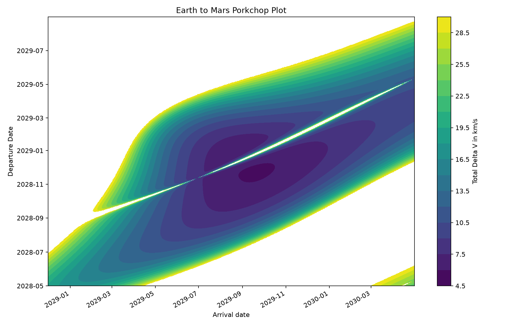

# astrodyn

A minimal, lightweight astrodynamics toolkit built from scratch with NumPy. `astrodyn` is designed to be portable and dependency-minimal.

## Quick Start

```zsh
git clone https://www.github.com/say-no-to-sleep/astrodyn
cd astrodyn
pip install -e .
```

### Small example

```python
import numpy as np, astrodyn.constants as constants, astrodyn.elements as elements, astrodyn.propagate as propagate, astrodyn.states as states
state = states.StateVector(np.array([7000., -12124., 0.]), np.array([2.6679, 4.6210, 0.]))
state = propagate.propagate_universal(state, 3600, constants.MU_EARTH)
orbit = elements.state_2_elements(state, constants.MU_EARTH)
print(f"r = {state.r_vec.round(3)} km\nv = {state.v_vec.round(6)} km/s\n(h, e, i, Omega, omega, theta) = {tuple(round(float(x), 6) for x in vars(orbit).values())}")
```

```text
r = [-3297.797  7413.38      0.   ] km
v = [-8.297605 -0.964074    -0.   ] km/s
(h, e, i, Omega, omega, theta) = (64692.6196, 0.499994, 0.0, 0.0, 1.047249, 0.942105)
```

## Modules

| Module | Description |
|--------|-------------|
| `states.py` | Containers for state vectors, orbital elements, and derived scalar quantities |
| `elements.py` | Conversion between state vectors and classical orbital elements |
| `propagate.py` | Two-body orbit propagation using universal variables and Lagrange coefficients |
| `lambert.py` | Lambert's problem solver |
| `frames.py` | Reference-frame transformations |
| `stumpff.py` | Stumpff C and S functions for universal-variable methods |
| `constants.py` | Common astrodynamics constants |

## Demo

### Earth–Mars porkchop plot



This demo plots the total delta-v required to depart from LEO (Low Earth Orbit) and capture into LMO (Low Mars Orbit) across a range of departure and arrival dates around the actual Space Reactor-1 Freedom mission, scheduled for December of 2028.

This uses JPL's DE442 Ephemeris through SPICE.

### Install the demo dependencies

This demo uses `spiceypy` for SPICE ephemerides and `matplotlib` for plotting. These are not installed with the core packages, so they needs to be installed separately.

```zsh
python -m pip install spiceypy matplotlib
```

### Download the SPICE kernels

Downloads the `de442.bsp` planetary ephemeris from the [NAIF planetary SPK directory](https://naif.jpl.nasa.gov/pub/naif/generic_kernels/spk/planets/) and place it at `data/de442.bsp`.

The leap-seconds kernel is included at `data/naif0012.tls`. You may download it as well from [NAIF](https://naif.jpl.nasa.gov/pub/naif/generic_kernels/lsk/naif0012.tls).

To downloads both kernels, run:

```zsh
curl -L https://naif.jpl.nasa.gov/pub/naif/generic_kernels/spk/planets/de442.bsp -o data/de442.bsp
curl -L https://naif.jpl.nasa.gov/pub/naif/generic_kernels/lsk/naif0012.tls -o data/naif0012.tls
```

### Run the demo

Run the demo from the repository root:

```zsh
python demos/porkchop.py
```

The script will print the minimum and maximum transfer delta-v values in the terminal in addition to the plot.

## Roadmap

- [ ] Port `astrodyn` to C
- [ ] Circular restricted three-body problem (CR3BP)
- [ ] Lagrange points
- [ ] Halo orbits
- [ ] J2 perturbations
